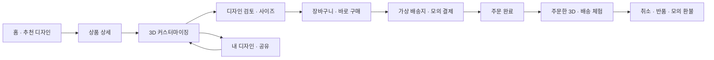
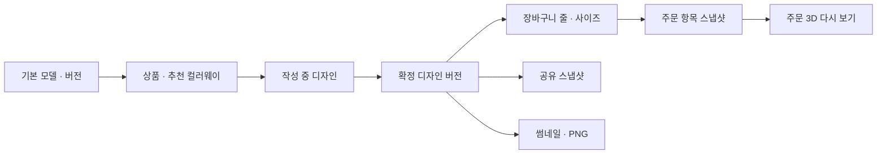

# NIJOOW 3D 커머스 포트폴리오 — 제품 기획 및 개발 계획

작성일: 2026-09-09 · 상태: 제품 방향·3D 진입/편집/표현 확정 / 추천안에 따른 상세 기획 진행 · 기준 코드: d416204

2026-09-10: 첫 로컬 실행 버전을 구현했어. 아래는 목표 명세이며, 실제 구현/검증 범위와 남은 작업은 [구현 체크포인트](/Users/woojin/Desktop/works/shopping-mall/docs/implementation/2026-09-10-checkpoint.md)를 기준으로 봐.

## 의사결정 진행 방식

사용자가 선택지 표시 문제로 **일단 추천대로 진행**하도록 요청했어. 방금 질문한 3D 상세 기본 노출·전용 전체 화면 스튜디오·현실적인 모델 표현은 추천안으로 확정하고, 같은 범위의 세부 기획도 추천안을 기준으로 진행해. 비동기 선택지 도구의 응답을 기다리며 기획을 멈추지 않아.

이미 확정한 선호는 아래 결정표를 따라. 추가 비용, 큰 기능 범위 변경, 실제 데이터 삭제처럼 별도 판단이 필요한 경우에는 채팅 본문으로 짧게 물어봐. 일반적인 화면 배치·동작 명세는 기획자의 판단으로 정리해. 사용자 답변 없이 시간이 지났다는 사실은 승인 근거로 사용하지 않아.

| 순서 | 결정할 내용 | 현재 상태 | 이후 영향을 받는 항목 |
|---|---|---|---|
| 1-1 | 브랜드와 초기 집중 상품군 | 확정: 패션 편집숍을 지향하고, 우선 스니커즈에 집중 | 편집숍 브랜드·확장 구조, 스니커즈 중심 1차 개발 |
| 1-2 | 데모 체험과 실제 로그인 | 확정: 데모 체험 + 기존 카카오·네이버·구글 소셜 로그인 사용 | 로그인 전후 디자인 보존, 실제 계정 저장, 제공자별 인증 검증 |
| 1-3 | 커스터마이징 깊이 | 확정: 모델·기능 재제작 허용. 조합의 조화와 품질을 유지할 수 있으면 부품 교체, 어려우면 색·재질·각인에 집중 | 조합 품질 검증 단계, 호환 옵션, 모델/부품 버전 |
| 2-1 | 에셋 제작 수단·예산 범위 | 확정: 무료 에셋 + Codex의 직접 제작·수정. 유료 에셋/외주는 기본 범위에 포함하지 않아 | 무료 후보 검수, 직접 모델링/재질 제작, 품질 검증 |
| 2-2 | 편집숍의 비주얼 방향 | 확정: 실험적인 패션 매거진형 편집숍 | 큰 타이포·비대칭 사진·제품 이미지 겹침을 중심으로 연출 |
| 2-3 | 의류·잡화의 첫 버전 2D 노출 | 확정: 첫 버전에 의류·잡화도 포함하고 스니커즈에 3D 집중 | 일반 2D 상품과 3D 커스텀 상품의 통합 탐색·주문 |
| 3-1 | 실험적인 디자인의 구체적 방향 | 확정: 비교 이미지 01 패션 매거진형 채택 | 홈·컬렉션·제품 상세·스튜디오를 같은 시각 스타일로 설계 |
| 3-2 | 브랜드 이름 | 확정: NIJOOW 유지. 필요하면 뒤에 단어를 붙이는 확장만 검토 | 로고·카피·브랜드 자산. 다른 기본 이름으로 교체하지 않아 |
| 3-3 | 첫 스니커즈 라인업 | 확정: 추천안대로 조형적인 러너 1종 + 단정한 로우탑 1종 | 기본 모델 총 2종, 실루엣·부품·재질 시제품 검수 |
| 4-1a | 문의·후기 | 확정: 후순위. 스니커즈 3D와 구매 흐름을 먼저 완성 | 핵심 1차 구현/완료 기준에서 분리하고 후속 백로그로 유지 |
| 4-1b | 별도 운영 체험 화면 | 확정: 주문 상세의 체험 기능을 먼저 제공하고 별도 운영 화면은 후순위 | 초기 별도 운영 메뉴 없음. 배송 진행·취소·모의 환불은 주문 상세에서 체험 |
| 4-2 | 소셜 로그인 때 가져올 익명 데이터 | 확정: 디자인·찜·장바구니·데모 주문 모두 계정에 이어서 보관 | 기존 계정 데이터 보존, 데모 주문 표시, 로그인 전후 작업 연속성 |
| 4-3 | 검수 우선 환경 | 확정: 데스크톱 우선 | 데스크톱 연출·3D 조작을 우선 검수하고 모바일 구매/편집의 사용성도 보장 |
| 4-4 | 스니커즈 상세 첫 화면 | 추천안으로 확정: 3D를 기본으로 로드하고 즉시 조작 가능. 로딩 중에는 같은 제품의 대표 이미지 표시 | 3D 진입 버튼 없이 상세에서 체험, 실패 시 이미지/정보/구매 유지 |
| 4-5 | 커스터마이징 편집 위치 | 추천안으로 확정: 전용 전체 화면 스튜디오 | 제품·편집 도구에 집중하고 상세/주문으로 상태를 보존하며 복귀 |
| 4-6 | 스니커즈 모델 표현 | 추천안으로 확정: 실제 제품 사진처럼 현실적인 재질과 정교한 디테일 | 러너·로우탑의 모델링/표면/각인 품질 목표. 시제품으로 달성 여부 검증 |
| 5 | 일정·품질 목표·공개 방식 | 자산과 범위 확인 후 질문 | 단계별 납품·검수·완료 판정 |

실결제 미연동, 포트폴리오 목적, 대규모 UI/코드 변경 허용은 이미 정해진 조건이므로 다시 확인하지 않아.

사용자의 부품 교체 조건은 무료 에셋과 직접 제작 범위에서 품질을 확인하기 위한 제작·기술 검증을 계획에 포함한다는 뜻이야. 무제한 부품 조합을 약속하지 않아. 해당 범위에서 품질을 확보하기 어렵다면 합의한 색·재질·각인 중심안으로 완성해.

## 1. 제품의 목표

**스니커즈의 3D 탐색·개인화·모의 주문 경험을 먼저 완성하는 패션 편집숍**으로 기획해. 첫 핵심 경험은 내가 디자인한 스니커즈를 주문하고, 주문 내역에서 같은 디자인을 다시 여는 흐름이야.

포트폴리오 방문자가 시각적 완성도와 기능의 연결을 모두 체험하는 게 목적이야. 실제 금전 결제·택배·상담원 업무는 시뮬레이션하지만 디자인 저장, 가격 계산, 장바구니, 재고 검증, 주문 기록, 접근 권한은 실제 서버 기능으로 구현해.

기존 UI·페이지·코드·DB 구조를 새 기획의 제약으로 삼지 않아. 기존 검토의 개별 문제는 새 제품 요구사항과 완료 기준에 흡수해. 실 PG 미연동은 이번 제품의 명시적인 범위이고 결함으로 취급하지 않아.

### 기획의 전제와 아직 결정되지 않은 것

| 구분 | 내용 |
|---|---|
| 사용자 확정 조건 | 포트폴리오 목적, 실결제 미연동, 대체 구매 흐름 완성, 대규모 UI/코드·모델 재제작 허용, 패션 편집숍 지향·스니커즈 3D 집중, 의류·잡화 2D 포함, 데모 + 기존 소셜 3종, 품질을 전제로 한 부품 교체, 무료 에셋 + 직접 제작, 실험적인 디자인 |
| 스니커즈 확정 라인업 | 조형적인 러너 1종 + 단정한 로우탑 1종, 기본 모델 총 2종이야. 개인화는 색·재질·각인을 기반으로 부품 교체의 품질 검증 결과를 반영해. |
| 남은 카탈로그 제안 | 각 모델의 추천 컬러웨이 4~6개와 의류·잡화 상품 수는 아직 미정이야. |
| 로그인 범위 | 카카오·네이버·구글을 유지 대상으로 확정했어. auth.ts에 등록된 제공자와 대조했고, 실제 OAuth 설정과 로그인 성공은 구현/검증 단계에서 각각 확인해야 해. |
| 상품 범위 상태 | 스니커즈 3D 모델 2종과 의류·잡화 2D를 첫 버전에 함께 제공해. 의류·잡화의 구체적 라인업과 상품 수는 미정이야. |
| 브랜드·디자인 | NIJOOW 이름을 유지하고 비교 시안 01 패션 매거진형으로 설계해. 필요하면 이름 뒤에 설명 단어를 붙일 수 있어. 접미어와 세부 카피는 아직 확정하지 않았어. |
| 제작 방식 | 무료 에셋 후보를 검수하고 필요한 모델·부품·UV·재질·이미지를 직접 제작·수정해. 추가 유료 에셋/외주는 계획에 포함하지 않아. |
| 검수 우선순위 | 데스크톱의 패션 매거진형 연출과 3D 편집 품질을 우선해. 모바일도 상품 탐색·편집·구매·주문 확인을 지원해. |
| 3D 경험 | 스니커즈 상세는 3D 기본, 편집은 전용 전체 화면 스튜디오, 모델 표현은 현실적인 제품 품질을 목표로 해. 모델의 실제 완성도는 아직 검증 전이야. |
| 기능 우선순위 | 문의·후기·별도 운영 화면은 모두 후순위야. 초기에는 주문 상세의 배송 진행·취소·모의 환불 체험을 완성해. |
| 회원 이관 | 로그인 전 디자인·찜·장바구니·데모 주문을 모두 계정에 이어서 보관해. 기존 계정 데이터는 보존하고 데모 주문은 명확히 표시해. |
| 후속 상세 결정 | 구체적 에셋과 제작 도구, 필요 시 NIJOOW 접미어, 컬러웨이/의류·잡화 상품 수, 구체적인 데이터 보관 기간·초기화 정책, 검수 실기기, 출시 일정. 이는 핵심 제품 방향을 다시 정하는 질문이 아니라 상세 설계/검증 단계의 선택이야. |
| 완료의 의미 | 합의한 상품·기기·시나리오 범위에서 기능이 연결되고 실패 복구까지 검증된 상태야. 모든 기기와 모든 기능을 무제한 지원한다는 뜻은 아니야. |

## 2. 누구를 위해 무엇을 보여줄까

| 방문자 | 하려는 일 | 사이트가 증명할 것 |
|---|---|---|
| 구매 체험자 | 제품을 보고 내 취향으로 바꿔 주문하기 | 조작이 쉽고, 선택 결과와 주문 결과가 일치해 |
| 채용 담당자·클라이언트 | 짧은 시간에 프로젝트의 특징과 완성도 판단하기 | 첫 화면에서 3D가 보이고 가입 없이 전체 흐름을 끝낼 수 있어 |
| 개발·디자인 검토자 | 상태 관리, 반응형, 예외 처리, 운영 연결 확인하기 | 새로고침·실패·취소·권한 분리에도 데이터가 일관돼 |

처음 방문해 **30초 이내에 색상 변경을 경험하고, 3분 안에 데모 주문까지 갈 수 있는 것**을 UX 목표로 잡아. 이 수치는 현재 성과가 아니라 앞으로 검증할 설계 목표야.

핵심을 보는 데 회원가입·실제 주소·카드번호가 필요하면 안 돼. 동시에 화면만 바뀌고 기록이 사라지는 체험도 피해야 해.

## 3. 제품 범위 결정

### 상품 구성

- 사이트의 브랜드·컬렉션·내비게이션은 패션 편집숍으로 확장할 수 있게 설계해. 초기 개발과 시연의 중심은 스니커즈야.
- 첫 버전에 의류·잡화도 2D 일반 상품으로 포함해. 사진·상품 설명·옵션·찜·장바구니·모의 주문까지 완성하고, 스니커즈와 함께 주문할 수 있어.
- 첫 스니커즈 모델은 조형적인 러너 1종과 단정한 로우탑 1종, 총 2종으로 확정했어. 실제 제품명과 세부 형상은 에셋 시제품을 보고 결정해.
- 기본 모델마다 추천 컬러웨이 4~6개를 운영해. 이는 같은 모델의 디자인 변형이고, 별개의 형태인 것처럼 표시하지 않아.
- 기본 모델마다 크기 옵션과 부위별 허용 색/재질/각인 영역을 정의해.
- 초기 개발에서는 모델 1종으로 전체 흐름을 먼저 완성하고, 두 번째 모델은 같은 계약을 따르는 자산으로 추가해.
- 3D 지원 스니커즈의 사진, 목록 썸네일, 프리셋 이미지, 공유 이미지, 주문 이미지는 승인된 모델과 디자인 설정에서 만들어. 사진과 3D가 서로 다른 제품을 보여주는 문제를 없애는 핵심 정책이야.
- 의류·잡화는 사용 조건을 확인한 무료 이미지와 직접 제작한 이미지로 구성해. 한 상품의 사진과 설명·옵션이 서로 일치해야 하고, 실제로 준비되지 않은 각도나 기능을 있다고 표시하지 않아.
- 실제 브랜드의 로고가 보이는 기존 사진·모델은 신규 브랜드 에셋 선정 단계에서 일치성과 사용 조건을 확인해. 현재 에셋의 사용 권한이 확인됐다는 전제는 두지 않아.

### v1 기능 범위

| 분류 | 포함 |
|---|---|
| 상품 탐색 | 검색, 정렬, 모델/사이즈/색상/가격/커스텀 가능 필터, 컬렉션, 상품 상세, 사이즈 가이드 |
| 일반 상품 | 의류·잡화의 2D 상세와 실제 선택 가능한 옵션, 스니커즈와 혼합 장바구니·선택 주문 |
| 3D | 회전·확대·고정 시점, 부위 선택, 색·허용 재질 변경, 각인, 프리셋, 원본 비교, 실행 취소/다시 실행, 품질 전환, 이미지 대체 |
| 부품 교체 | 조건부 포함: 같은 모델군 안에서 시각·기하·성능 검수를 통과한 조합만 제공. 기준 미달이면 색·재질·각인으로 완성 |
| 로그인 | 독립 데모 체험 + 카카오·네이버·구글. 로그인 뒤 디자인/주문을 다시 찾는 경험과 제공자별 실패 복구 포함 |
| 디자인 | 자동 임시 저장, 이름 지정, 내 디자인 목록, 복제, 공유 링크, 공유 디자인에서 내 사본 만들기, PNG 저장 |
| 구매 | 옵션별 장바구니, 선택 상품 주문, 바로 구매, 가상 배송지, 서버 가격/재고 확인, 모의 결제 승인·실패·사용자 취소·응답 지연 |
| 주문 후 | 주문 상세, 주문한 3D 다시 보기, 배송 단계 체험, 주문 취소, 배송 완료 후 전체 반품·모의 환불 |
| 내 공간 | 체험 프로필, 찜, 디자인, 주문, 가상 배송지. 내 문의는 후속 기능 |
| 고객 지원 | 초기에는 상품별 FAQ와 데모 이용 안내. 문의·답변·후기는 후순위 |
| 주문 후 체험 | 주문 상세에서 배송 단계 진행, 취소·모의 환불을 체험. 별도 운영 화면은 후순위 |
| 품질 | 반응형, 키보드/스크린리더 접근성, 실패 복구, 기본 SEO, 오류 관측, 핵심 흐름 회귀 테스트 |

### 후속 기능

- **문의·답변·후기:** 사용자 결정으로 후순위야. 3D와 구매 흐름의 핵심 완료를 막는 조건에서 제외하고 후속 백로그에 남겨. 초기 화면에는 빈 문의/후기 탭이나 동작하지 않는 작성 버튼을 노출하지 않아.
- **별도 운영 체험 화면:** 사용자 결정으로 후순위야. 실제 쇼핑몰 관리자 화면처럼 내 데모 주문·배송·재고를 조작하는 화면을 뜻해. 초기에는 별도 운영 메뉴를 노출하지 않고 주문 상세에서 배송 진행·취소·모의 환불을 체험해.

### v1에서 제외할 것

- 실제 PG, 실제 송장/배송 API, 실제 이메일·SMS 발송.
- 이메일/비밀번호 신규 가입은 제외 추천을 유지해. 사용자가 확정한 로그인 범위는 데모 체험과 기존 소셜 3종이야. 기존 일반 계정의 전환·접근 정책은 별도로 정하고 실제 사용자 데이터를 임의로 지우지 않아.
- AR 가상 착화, 발 사이즈 자동 측정, 실시간 공동 편집, 공개 커뮤니티 피드, AI 추천/생성.
- 다중 판매자, 정산, 세금계산, 다국가 통화, 복잡한 쿠폰·등급·포인트 제도.
- 부분 취소·부분 반품·교환. v1에서는 주문 전체 단위로 정책을 명확히 해.
- 일반 방문자의 임의 3D 파일 업로드와 에셋 편집 도구. 등록 가능한 모델은 검증된 에셋 목록으로 제한해.

제외 기능은 비활성 버튼이나 빈 메뉴로 남기지 않아. v1에 표시한 메뉴와 버튼은 모두 완료 가능한 기능이어야 해.

소셜 3종은 유지하되 이메일만으로 계정을 자동 병합하는 기존 구현은 교체해. 사용하지 않기로 확정한 가입 API는 화면의 링크와 함께 정리해. 기존 사용자 데이터의 이관·보존은 새 데모 구현과 구분해 결정해.

### 패션 편집숍의 확장 구조

첫 버전의 정보 구조에 `전체 상품 / 스니커즈 / 의류 / 액세서리 / 내 디자인`을 반영해. 의류·잡화도 준비된 2D 상품을 탐색하고 주문할 수 있어야 해. 기존 상품·이미지를 사용할지는 새로운 편집숍 콘셉트와 에셋 검수 결과로 판단해.

상품마다 `3D 보기 가능`과 `커스터마이징 가능`을 독립적으로 관리해. 일반 상품은 모델이 없어도 사진·옵션·장바구니·주문 기능을 사용할 수 있고, 커스텀 상품은 추가로 디자인 버전을 연결해. 스니커즈 전용 부위·사이즈 규칙을 모든 상품의 공통 필수값으로 만들지 않아.

후속 카테고리에 3D를 도입할 때는 해당 제품의 모델·재질·옵션 계약과 자산 제작 단계를 추가해. 모든 카테고리의 3D 지원을 이번 확정 범위로 해석하지 않아.

## 4. 사용자 경험의 중심 흐름

### 대표 시나리오 A — 첫 방문에서 주문까지

1. 홈에서 실제 상품의 대표 각도와 컬러웨이를 봐.
2. `내 스타일로 바꾸기`를 눌러 해당 모델과 프리셋이 설정된 편집기로 들어가.
3. 부위를 누르거나 부위 목록에서 선택하고 색을 바꿔. 선택된 부위에 맞는 카메라 시점으로 이동할 수 있어.
4. 재질과 각인을 선택하고, 변경 옵션·추가 금액·총액을 확인해.
5. 사이즈를 고른 뒤 `바로 주문하기`를 눌러 현재 디자인 한 개의 주문으로 이동해.
6. 이미 준비된 가상 배송지를 확인하고 `데모 결제하기`를 눌러.
7. 주문 번호와 디자인 썸네일을 받고, 주문 상세에서 방금 만든 3D를 그대로 다시 열어.

진입 시 세션은 자동 준비하지만 안내 팝업으로 체험을 가로막지 않아. 헤더의 `포트폴리오 데모` 안내와 체크아웃의 `실제 결제와 배송은 발생하지 않아` 문구로 성격을 알려.

### 대표 시나리오 B — 저장·공유·수정

디자인을 저장하고 새로고침해도 그대로 복원돼. 공유 링크는 발행 시점의 읽기 전용 디자인을 보여줘. 다른 방문자가 `내 디자인으로 만들기`를 누르면 자기 체험 공간에 사본이 생겨. 이후 수정은 원본·기존 공유 링크·이미 주문한 디자인에 영향을 주지 않아.

### 대표 시나리오 C — 실패와 복구

체험 메뉴에서 이번 결제의 실패 또는 응답 지연을 선택해. 결제 실패 후에도 디자인·장바구니·배송지를 유지해. 응답 지연으로 성공 여부가 불명확하면 먼저 같은 주문의 처리 결과를 조회하고, 재시도해도 주문이 하나만 생기도록 해.

### 대표 시나리오 D — 운영과 주문 후 처리

확정한 초기 흐름은 내 주문 상세의 `배송 진행 체험`으로 상태를 다음 단계로 바꾸는 거야. 준비 중에는 주문 취소, 배송 완료 후에는 전체 반품을 신청할 수 있어. 처리 결과는 주문 타임라인·모의 환불·가상 재고에 함께 반영돼. 별도 운영 화면 없이 주문 후 동작을 체험할 수 있어.

별도 운영 화면을 만들 경우에는 내 체험 공간의 주문을 목록에서 찾아 배송 상태·재고·모의 환불을 처리해. 실제 관리자 권한이나 다른 방문자의 데이터에는 접근하지 않아. 문의 답변 도구는 문의 기능과 함께 후속으로 개발해.

### 대표 시나리오 E — 데모에서 소셜 로그인으로 이어가기

가입 없이 디자인을 만든 뒤 카카오·네이버·구글 중 하나로 로그인할 수 있어. 로그인에 성공하면 출발했던 디자인/체크아웃으로 돌아가고, 실패·동의 취소 시에도 현재 데모의 작업을 잃지 않아.

**로그인 전 디자인·찜·장바구니·데모 주문을 모두 계정에 이어서 보관하는 것으로 확정했어.** 방금 만든 디자인과 주문을 로그인 후에도 다시 열 수 있어야 구매 체험이 자연스럽게 이어져.

기존 계정의 저장 항목은 덮어쓰지 않고 추가/병합해. 데모 주문은 새로 결제하거나 재생성하지 않고 기존 스냅샷과 함께 계정의 소유 기록으로 연결하며 `데모 주문`으로 표시해. 같은 이관의 재시도도 중복 기록이나 재고 차감을 만들지 않아. 보관 기간·초기화 범위는 이관 대상 결정과 구분해 명세화해.

## 5. 화면 구성과 행동 계약

메인 내비게이션은 `쇼핑 / 커스텀 스튜디오 / 내 디자인`, 우측은 검색·찜·장바구니·내 공간으로 구성해. 모바일은 `쇼핑 / 스튜디오 / 내 디자인 / 장바구니 / 내 공간`을 기본으로 해. 별도 운영 메뉴는 후속 기능을 구현할 때 추가해.

| 화면 | 주된 목적 / 핵심 내용 | 다음 행동 | 필수 예외 상태 |
|---|---|---|---|
| 홈 | 실제 제품 비주얼, 추천 컬러웨이, 짧은 조작 예시 | 상품 보기 / 내 스타일로 바꾸기 | 3D 로딩 전 이미지, 모델 실패 대체 |
| 상품 목록 | 결과 수, 적용 필터, 정렬, 디자인별 상품 카드 | 상세 보기 / 찜 | 검색 0건, 조회 실패, 품절, 필터 초기화 |
| 상품 상세 | 스니커즈는 3D 기본·로딩 중 대표 이미지, 일반 상품은 사진. 가격, 사이즈, 실제 옵션 설명, FAQ. 후기는 후속 | 전체 화면 커스터마이징 / 바로 주문 / 담기 | 옵션 미선택, 품절, 미지원 3D, 잘못된 URL |
| 커스텀 스튜디오 | 전용 전체 화면에 제품 뷰, 편집 단계, 현재 변경과 가격 | 저장 / 주문 전 검토 / 원래 상세로 복귀 | 저장 중·실패, 모델 실패, 뒤로 가기, 잘못된 공유 설정 |
| 주문 전 검토 | 모든 부위의 색·재질·각인, 사이즈, 추가 금액 | 담기 / 바로 주문 | 재고·가격 변경, 필수 옵션 누락 |
| 내 디자인 | 작성 중/저장한 디자인, 최종 수정 시각 | 이어서 편집 / 복제 / 공유 / 삭제 | 빈 목록, 저장 실패, 사용할 수 없는 모델 버전 |
| 공유 디자인 | 공개한 디자인의 3D와 구성만 표시 | 내 사본 만들기 / 상품 보기 | 만료·회수·없는 링크 |
| 장바구니 | 선택 줄, 정확한 커스텀 썸네일, 옵션, 수량, 합계 | 선택 상품 주문 / 디자인 수정 | 삭제·판매 중단 상품, 재고 부족, 조회 실패 |
| 체크아웃 | 가상 배송지, 주문 구성, 금액, 데모 결제 안내 | 데모 결제하기 | 승인 실패, 취소, 응답 지연, 재고 경쟁, 세션 만료 |
| 소셜 로그인 | 카카오·네이버·구글 선택, 계속 체험, 계정 저장 안내 | 인증 후 원래 작업으로 복귀 | 동의 취소, 제공자 오류, 이메일 미제공, 연결 충돌, 로그인 전 데이터 유지 |
| 주문 완료/상세 | 디자인 스냅샷, 상태 타임라인, 주문 번호, 금액 | 3D 다시 보기 / 배송 체험 / 취소·반품 | 처리 중, 취소됨, 반품 중, 환불됨, 접근 불가 |
| 내 공간 | 체험 프로필, 가상 주소, 주문, 찜, 내 디자인 | 각각의 상세 | 데이터 없음, 세션 만료 안내, 초기화 확인 |
| 문의/후기 — 후속 | 작성 내용과 주문·상품 맥락 | 등록 / 수정 / 삭제 | 권한 없음, 중복 후기, 미배송 주문, 입력 오류 |
| 별도 운영 화면 — 후속 | 내 공간의 재고·주문·환불. 문의 기능 개발 후 문의도 연결 | 허용된 상태 변경 | 불가능한 전이, 동시 변경, 조회/저장 실패 |

전체 공개 화면의 기본 언어는 한국어로 통일해. 영어는 브랜드명과 짧은 장식 라벨에 사용하고, 결제·오류·배송·삭제 같은 중요한 판단은 한국어로 전달해.

## 6. 3D 편집기의 상세 기획

편집은 전용 전체 화면 스튜디오에서 진행해. 브라우저의 OS 전체 화면 전환 권한을 요구하는 방식이 아니라, 사이트 내 전용 경로가 뷰포트를 채우는 방식이야. 상세에서 본 모델·프리셋·선택한 사이즈를 전달하고 뒤로 이동해도 작성 중 디자인을 유지해.

화면별 배치·상태·입출력은 [데스크톱 화면 상세 명세](/Users/woojin/Desktop/works/shopping-mall/docs/planning/desktop-experience-spec.md)를 따르며, 수치는 선택한 콘셉트를 구현하기 위한 초기 설계값이야.

### 편집 순서

`디자인 시작 → 부위와 색 → 재질 → 각인 → 사이즈·최종 검토`로 진행해. 자유롭게 이전 단계로 돌아갈 수 있고 선택을 잃지 않아.

부품 교체가 품질 기준을 통과하면 `디자인 시작` 다음에 `형태 구성` 단계를 추가해. 선택한 부품에 맞춰 이후 부위·재질·각인 가능 영역이 바뀌어야 해.

| 기능 | 정책 |
|---|---|
| 부위 선택 | 3D 직접 클릭과 텍스트 목록 두 방식 제공. 마우스 조작이 어려워도 편집 가능해야 해. |
| 형태 구성 | 조건부 기능. 검수된 부품과 호환 조합만 선택 가능하게 해. 기본 실루엣을 해치거나 연결부가 맞지 않는 조합은 노출하지 않아. |
| 색상 | 추천 팔레트에 색 이름과 HEX를 제공. 자유 색상은 허용한 부위에서만 사용하고 서버에서도 형식을 검증해. |
| 재질 | 부위별로 승인된 재질만 제공. 예를 들어 아웃솔에 허용하지 않은 천 재질은 선택지에 나오지 않아. |
| 각인 | 승인된 표면 영역에 붙는 방식으로 표시. 초기 제안은 영문 대문자·숫자·공백 8자 이내야. 실제 지원 폰트/UV를 확인한 뒤 확정해. 임의 이미지 업로드는 없어. |
| 프리셋 | 상품 목록에서 본 컬러웨이가 그대로 시작값이 돼. 다른 프리셋을 적용하면 변경사항을 되돌릴 수 있어. |
| 원본 비교 | 원본을 잠시 보더라도 현재 편집 내용은 유지해. |
| 실행 취소/다시 실행 | 부위·색·재질·각인 및 허용된 부품 교체를 변경 단위로 기록해. 카메라 조작은 편집 기록에 포함하지 않아. |
| 카메라 | 기본 3/4, 측면, 뒤꿈치, 밑창, 전체 보기. 선택 부위의 가까이 보기와 시점 초기화를 제공해. |
| 조명 | 기본은 색을 판단하기 쉬운 중립 스튜디오. 연출 조명은 보조 옵션이며 가격·상품 구성에 포함하지 않아. |
| 저장 | 작성 중 자동 저장과 저장 상태 표시. 실패 시 로컬 초안을 남겨 재시도할 수 있게 해. |
| 주문 연결 | 편집 결과의 디자인 버전과 사이즈가 장바구니·주문에 함께 들어가. 이미지 파일만 저장해서 연결을 대신하지 않아. |
| 내보내기 | 배경 선택이 가능한 PNG. 모델·각인·색이 현재 저장 버전과 일치해야 해. |

### 모바일 레이아웃

데스크톱이 우선 검수 환경이야. 큰 제품 뷰와 편집 패널, 마우스·키보드 조작과 매거진형 연출을 먼저 완성하고 아래 모바일 적응형 레이아웃을 검증해. 모바일을 단순 소개 화면으로 축소하지 않아.

- 상단에 제품 뷰가 남고 하단 패널에서 부위·색·재질을 편집해. 컬러를 선택하면서 제품 변화를 동시에 볼 수 있어야 해.
- 패널은 작은 상태/확장 상태를 제공하되, 편집 중 뷰어가 완전히 가려지지 않게 해.
- 확대된 각인 입력처럼 키보드가 열리는 상황에서는 입력과 적용 버튼을 우선 보장하고 닫으면 원래 편집 상태로 복귀해.
- 페이지 스크롤과 3D 회전 제스처의 영역을 분리하고 명확한 조작 힌트를 한 번 제공해.
- 편집기의 하단 주문 CTA는 모바일 공통 내비와 겹치지 않게 전용 배치를 사용해.

### 기본 시각 방향

사용자가 **01 패션 매거진형**을 선택했어. [선택된 시안](/Users/woojin/Desktop/works/shopping-mall/docs/planning/concepts/2026-09-09/01-editorial-magazine.png)을 홈·컬렉션·상품 상세·커스텀 스튜디오의 공통 아트 디렉션으로 삼아.

[세 방향의 이미지 비교 기록](/Users/woojin/Desktop/works/shopping-mall/docs/planning/concepts/2026-09-09/README.md)은 보존해. 선택은 시각 방향에 대한 것이고 이미지 속 상품 형태·카피·세부 배치를 모두 확정한 것은 아니야. 다른 시안과의 혼합을 자동으로 확정하지 않아. 실제 3D 자산의 품질 검수는 별도 단계에서 진행해.

| 요소 | 선택 시안에서 이어갈 원칙 |
|---|---|
| 바탕과 색 | 따뜻한 종이색 계열, 짙은 먹색 타이포, 소량의 붉은 편집 표시. 정확한 색상값은 접근성과 제품 색 표현을 확인하며 정해 |
| 타이포 | 크고 압축된 제목과 정돈된 본문을 조합해. 큰 제목은 캠페인/컬렉션에서 사용하고 가격·옵션·오류는 충분히 읽히는 크기로 유지해 |
| 사진 | 스니커즈 전체 컷, 소재의 가까운 컷, 의류/잡화 사진의 크기와 위치를 달리해 큐레이션을 표현해 |
| 구성 | 비대칭 그리드와 의도적인 이미지 겹침, 얇은 구분선, 작은 인덱스. 제품명과 주요 버튼을 이미지가 가리지 않게 해 |
| 공통 도구 | 헤더·검색·필터·장바구니·폼은 위치와 역할을 일관되게 유지해 |
| 모바일 | 데스크톱 구성을 그대로 축소하지 않고 제목→제품→행동의 읽는 순서로 재배치해. 겹침은 제품과 버튼이 명확한 범위로 줄여 |
| 모션 | 이미지의 등장·배치 전환·3D 시점 이동에 제한적으로 적용해. 조작을 기다리게 하는 긴 연출은 넣지 않아 |

홈에는 러너를 중심으로 로우탑·의류·잡화의 편집 컷을 연결하고, 상품 목록은 필터와 비교가 쉬운 정돈된 배열로 풀어. 상품 상세는 큰 대표 이미지와 소재 디테일을 활용하되 옵션·가격·주문 동선을 명확하게 둬.

커스텀 스튜디오에도 같은 종이색·먹색·타이포·얇은 선을 적용해. 제품 캔버스와 편집 도구를 분명하게 나누고 색·재질·각인·저장 상태를 한눈에 확인할 수 있게 해. 스튜디오만 다른 브랜드처럼 보이는 테마로 바꾸지 않아.

제품 색과 형태를 판단하는 스튜디오의 기본 조명은 중립적으로 유지해. 검색·옵션·가격·장바구니·결제 조작은 위치와 역할이 명확해야 해. 특정 다크 테마나 기존 형광색은 확정 조건이 아니야.

표현 원칙은 제품과 편집 의도가 먼저 보이게 하는 것이야. 스크롤을 강제로 빼앗거나, 읽기 힘든 글자와 커서 효과로 구매를 어렵게 만드는 동작은 넣지 않아. 주요 모션에는 감소된 모션 설정과 터치/키보드 대체 동작을 적용해.

3D를 로드하기 전에도 같은 상품의 정지 이미지와 가격/구매 정보가 보여야 해. 로딩률을 알 수 없을 때 가짜 백분율을 만들지 않고 현재 단계와 재시도를 안내해.

## 7. 에셋 제작·검수 계획

3D 완성도는 UI 개발만으로 해결되지 않아. 에셋을 가장 먼저 검증해야 해.

표현 목표는 실제 제품 사진처럼 현실적인 스니커즈야. 어퍼의 메시/가죽 결, 패널 경계와 봉제선, 끈의 두께, 미드솔/아웃솔의 형태와 거칠기, 표면에 붙는 각인을 검수해. 무료 에셋과 직접 제작으로 이 목표를 달성할 수 있는지는 별도 시제품 검증이 필요해. 형태 교체 기능을 늘리기 위해 재질과 제품의 조화 수준을 낮추지 않아.

### 확정된 조달 방식 — 무료 에셋 + 직접 제작

1. 웹 공개·수정 범위를 확인할 수 있는 무료 에셋을 후보로 모으고 출처와 사용 조건을 기록해.
2. 실루엣, 부위 분리, UV, 재질, 로고/브랜드 적합성, 용량을 검수해서 직접 개선하기 좋은 기본형을 골라.
3. 필요한 메시·부품·접합 구조·UV·재질을 Codex가 무료 제작 도구와 스크립트로 직접 만들거나 수정해. 적합한 무료 기본형이 없으면 직접 제작한 단일 모델의 품질부터 검증해.
4. 같은 원본에서 정지 이미지, 프리셋, 모바일용 자산, 각인 영역을 제작해. 로딩·편집·주문 복원에 맞게 내보내.
5. 대표 각도 캡처와 실제 3D 조작으로 검수하고, 통과한 자산만 상품에 연결해.

직접 제작 결과가 높은 품질에 도달할지는 시제품으로 확인해야 해. 형태를 단순화하거나 부품 교체 범위를 줄여도 제품의 조화와 표면 품질을 유지하는 방향을 우선해. 유료 구매나 외주를 기본 해결책으로 전환하지 않아.

의류·잡화용 2D 자산도 무료 원본/직접 제작 범위로 제한해. 수가 많아 보이게 채우기보다 각 상품의 대표 이미지·옵션·설명·상세 이미지가 같은 제품을 표현하는지 검수해.

| 자산 산출물 | 통과 기준 |
|---|---|
| 확정할 수의 기본 모델 | 정면·측면·후면·밑창에서 형태가 자연스러워. 여러 모델을 채택하면 실루엣도 구분돼야 해 |
| 부위 매핑 | 사용자에게 보이는 부위 이름과 실제 선택 영역이 일치해 |
| UV/재질 | 색을 바꿔도 봉제선·표면 정보가 유지되고 승인된 재질만 적용돼 |
| 각인 영역 | 신발 표면에 붙어 보이며 대표 시점에서 떠 보이거나 파고들지 않아 |
| 좌표·크기·카메라 | 원점·단위·기본 각도가 통일되고 화면 크기가 달라도 프레임 안에 들어와 |
| 품질 단계 | 모바일용과 고품질 자산 또는 품질 설정을 제공해 |
| 정지 이미지 | 모델과 설정에서 대표컷/보조컷/프리셋/공유 이미지를 생성해 |
| 의류·잡화 2D 이미지 | 상품별 사진·옵션·설명이 일치하고 필요한 원본의 사용 조건을 확인할 수 있어 |
| 버전 정보 | 모델 버전, 허용 옵션, 각인 제약, 원본 출처/사용 조건을 기록해 |

검수에는 흰색·검정·고채도 색, 모든 프리셋, 최대 길이 각인, 모바일 세로/가로를 포함해. 파일 형식 검사 통과만으로 비주얼 승인을 대신하지 않아.

모델 1종이 이 기준을 통과하지 못하면 전체 페이지 개발보다 자산의 교체·수정을 먼저 진행해. 확정한 러너 1종 + 로우탑 1종을 모두 검수하고, 모델 수를 임의로 줄여 완료 처리하지 않아.

### 부품 조합의 품질 검증 — 기능 채택 전 필수 단계

사용자 조건은 조합의 조화와 제품 퀄리티가 우선이야. 기본 모델 1종에서 교체 부위 1~2개와 소수 변형을 시제품으로 제작해 가능성을 판정하는 방식을 추천해. 예를 들어 끈/힐 패널을 먼저 보고, 전체 실루엣과 접합부에 영향이 큰 밑창 교체까지 범위를 넓힐지 판단해. 실제 시제품 부위는 에셋 제작 여건을 확인한 뒤 정해.

| 검증 축 | 채택 기준 |
|---|---|
| 조형의 조화 | 개별 부품뿐 아니라 조합 후 전체 실루엣·비율·선의 흐름이 같은 제품군으로 자연스럽게 보여 |
| 접합 품질 | 뒤꿈치·어퍼·밑창 등의 경계에 틈, 파고듦, 떠 보이는 부분, 뒤집힌 면이 없어 |
| 표면 품질 | 교체 부품 사이에 재질 해상도·봉제선·거칠기·색 반응의 수준이 맞고 각인도 새 표면에 정확히 붙어 |
| 선택 정책 | 검수된 호환 조합만 노출하고 부품 변경으로 기존 선택이 무효가 되면 변경 이유와 대체 선택을 안내해 |
| 상태 일치 | 부품 선택도 저장·Undo/Redo·공유·썸네일·견적·주문 3D에 정확히 반영돼 |
| 모바일 품질 | 교체 중 오류/과도한 정지가 없고 선택한 대표 기기에서 성능·가시성 기준을 충족해 |

최종 노출할 형태 조합은 모두 대표 각도에서 검수해. 예를 들어 밑창 2개×끈 2개이면 4가지 조합을 모두 확인하고, 색/재질/각인은 경계값과 대표 조합을 추가 검증해. 대표 한 조합의 성공만으로 나머지를 정상으로 간주하지 않아.

- **통과:** 검수된 모델군과 조합에 한해 부품 교체를 v1에 포함해. 서로 다른 모든 모델의 부품을 임의로 섞는 기능은 약속하지 않아.
- **일부 통과:** 품질이 검증된 부위·옵션만 제공해. 통과하지 않은 조합은 공개하지 않아.
- **미달:** 사용자가 허용한 대로 형태 교체를 제외하고 색·재질·각인 품질을 완성해. 실패 이유와 실제 화면 근거를 공유해.

판정 근거는 대표 각도 캡처, 모바일 조작 결과, 조합별 문제와 제작 비용/시간 영향이야. 추가 비용이나 큰 범위 변경이 필요하면 결과를 보여주고 다시 질문해. 이번 기획 단계에서 모듈형 모델의 고품질 구현 가능성이 입증된 것은 아니야.

## 8. 포트폴리오 전용 데모 정책

### 방문자별 독립 체험 공간

- 첫 방문에 서버가 익명 체험 세션을 만들고 안전한 쿠키로 소유권을 연결해. 모두가 같은 테스트 계정을 사용하지 않아.
- 장바구니·디자인·주문·문의·가상 재고는 해당 체험 공간에만 속해. 다른 방문자의 주문 때문에 재고가 소진되거나 다른 방문자의 데이터가 노출되면 안 돼.
- 상품/모델의 공개 카탈로그는 읽기용으로 공유하되 체험 운영실의 가격·노출·재고 변경은 자기 공간의 사본/변경값에만 적용해.
- 비로그인 체험에는 가상 프로필을, 구매에는 로그인 여부와 관계없이 가상 배송지를 제공해. 배송/결제를 위해 실제 전화·주소·카드 정보를 요구하지 않아. 소셜 로그인은 사용자가 선택했을 때 필요한 계정 정보만 받아.
- 비로그인 데모는 마지막 이용 후 7일 보관을 초기 제안값으로 잡아. 로그인 계정에 저장한 디자인/주문에는 이 만료 규칙을 자동 적용하지 않아. 회원 데이터의 보관 기간·삭제 정책은 별도로 확정해.
- `체험 초기화`는 확인 후 현재 체험 공간만 대상으로 해. 실제 소셜 계정 삭제나 계정에 저장한 디자인 삭제와 구분해. 전역 테이블을 삭제하는 방식은 사용하지 않아.
- 공개 공유 링크에는 제품·디자인·미리보기만 들어가. 체험 프로필, 배송지, 주문 ID, 비공개 디자인 목록은 공개하지 않아.
- 공유 링크는 발행된 스냅샷을 가리키고 만료·회수 정책을 안내해. 비로그인 공유의 제안값은 발행 후 7일이야. 익명 공간 삭제 시 해당 공간 소유의 공유를 회수하고, 계정으로 이관된 디자인의 공유와는 구분해.

### 데모와 소셜 계정을 함께 운영하는 원칙

- 카카오·네이버·구글을 실제 로그인 제공자로 유지해. 로그인 후에도 결제·배송은 모의 흐름이야.
- 제공자의 고유 사용자 ID를 신원 기준으로 삼고, 이메일만 같다고 다른 소셜 계정을 자동 병합하지 않아.
- 다른 제공자를 기존 계정에 연결하는 기능을 제공한다면 기존 계정의 재인증과 연결할 제공자의 인증이 모두 필요해. 제공자 유지가 계정 연결 기능 전체의 범위까지 자동 확정하는 것은 아니야.
- 익명 작업을 계정으로 가져올 때 서버가 해당 익명 공간과 인증된 계정의 소유권을 확인하고, 기존 계정 데이터와 충돌해도 내용을 잃지 않게 해. 이관은 재시도해도 중복되지 않아야 해.
- 로그인 성공·동의 취소·제공자 실패 모두 출발 화면과 작성 중 내용을 보존해. 익명 세션/로그인 세션 전환 후 이전 권한을 재사용하지 못하도록 검증해.
- 소셜 3종의 개발·공개 환경 콜백, 실제 성공, 취소, 필수 정보 미제공을 각각 확인해. 현재 코드에 등록되어 있다는 사실과 실제 인증 성공은 별개야.
- 체험 운영실은 자기 체험 공간을 조작하는 기능이야. 소셜 로그인이나 체험 운영실 접근이 공개 카탈로그·전체 회원 데이터의 실제 관리자 권한을 부여하지 않아.

### 무엇이 실제이고 무엇이 모의일까

| 항목 | 구현 방식 |
|---|---|
| 카카오·네이버·구글 로그인 | 실제 제공자 인증. 선택적으로 로그인하며 기본 데모 흐름은 비로그인으로도 가능 |
| 모델·색·재질·각인 | 실제 화면 렌더링과 실제 구성 데이터 |
| 디자인·장바구니·주문 저장 | 실제 서버 영속화, 방문자 소유권 적용 |
| 옵션 검증·가격 계산·재고 | 실제 서버 로직. 재고는 방문자별 가상 재고 |
| 결제 승인·실패·취소 | 외부 PG 대신 서버의 DemoPaymentProvider가 처리 |
| 배송 진행 | 명시적인 체험 버튼/체험 운영실로 단계 진행 |
| 환불 | 실제 금전 이동 없이 모의 환불 기록과 재고 복구 |
| 알림 | 앱 안 알림만 사용. 실제 이메일·문자는 발송하지 않아 |
| 후기·문의 — 후속 | 구현 시 방문자의 작성·수정·삭제·답변 상태는 실제 저장. 미리 넣은 내용은 `샘플 후기/샘플 문의`라고 표시 |

후속 후기 기능을 만들 때 상품 후기 영역에는 공통 샘플과 내 체험 공간의 글만 표시해. 다른 방문자가 작성한 내용은 공개 피드로 유통하지 않아. 체험 운영실의 답변도 내 공간에만 반영되고 실제 상담원이 응답한 것처럼 표시하지 않아. 초기 핵심 흐름에는 후기·문의 작성 기능을 포함하지 않아.

### 체험 시나리오 메뉴

메인 흐름의 기본값은 정상 승인으로 해. 보조 메뉴 `다른 상황 체험하기`에서 이번 주문에만 결제 실패·응답 지연·재고 부족을 선택할 수 있어. 사용자가 선택한 뒤 실패 이유와 복구 과정을 명확하게 보여줘. 기술적인 에러 코드·토큰·DB 정보는 일반 쇼핑 화면에 노출하지 않아.

## 9. 가격·재고·주문 정책

1. 기본 가격과 추가 금액은 데모 카탈로그의 정책으로 관리해. 색상은 무료, 일부 재질과 각인은 추가 금액이 있는 구성을 추천해. 부품 교체를 채택하면 부품별 추가 금액도 같은 견적에 포함해. 최종 샘플 금액은 상품 기획 단계에서 확정하고 모든 화면에 같은 정책을 적용해.
2. 원화만 지원해. 상품별 기본 가격 + 옵션 추가 금액에 수량을 곱하고 주문 단위 배송비를 더해. 배송비와 무료배송 기준은 단일 정책으로 관리해.
3. 재고 단위는 `기본 모델 + 사이즈`를 기본 제안으로 해. 주문 제작 색상·각인은 같은 기본 신발 재고를 함께 사용해. 부품 교체를 채택하면 어떤 조합이 같은 재고를 쓰는지 상품 정의에서 정하고 UI와 서버에 동일하게 적용해. 프리셋/디자인마다 임의로 독립 재고를 만들지 않아.
4. 같은 상품의 여러 디자인/장바구니 줄이 같은 모델·사이즈 재고를 사용하면 수량을 합쳐 검증해. UI와 서버는 동일한 구매 수량 상한을 적용해.
5. 장바구니 줄 식별자는 상품, 사이즈, 확정한 디자인 버전/구성으로 해. 다른 각인이나 색은 다른 줄이고, 완전히 같은 구성만 수량을 합쳐.
6. `바로 주문하기`는 현재 상품/디자인만 대상으로 해. 기존 장바구니의 다른 상품은 유지해. `선택 상품 주문`은 선택한 줄만 주문해.
7. 주문 제출 시 가격을 서버에서 재계산해. 화면에서 본 견적과 달라졌다면 변경 내용을 보여주고 다시 확인하게 해. 조용히 더 높은 금액으로 확정하지 않아.
8. 모의 승인 성공을 확정하는 짧은 DB 트랜잭션에서 재고 조건과 옵션을 다시 확인하고 주문을 확정해. 실패/취소 상태에서는 재고를 차감하지 않아. 승인 대기 중 외부 호출이나 연출 지연으로 DB 잠금을 오래 유지하지 않아.
9. 주문 의도와 결제 시도에 고유 키를 둬. 같은 시도의 재전송은 같은 결과를 반환해. 실패한 뒤 새로 시도할 때만 새 결제 시도를 만들고 주문이 중복 확정되지 않게 해.
10. 장바구니 정리는 성공한 주문의 줄/수량에만 적용해. 결제 도중 다른 탭에서 추가한 상품까지 지우지 않아.
11. 취소·반품 완료 시 재고 복구와 모의 환불을 한 번만 적용해. 중복 클릭과 재요청으로 재고가 늘어나면 안 돼.
12. 결제 의도/주문에 저장한 가격·옵션·디자인은 스냅샷이야. 이후 카탈로그 가격이나 내 디자인을 바꿔도 이미 확정한 주문은 바뀌지 않아.

### 상태 전이

| 영역 | 정상 전이 | 실패/취소와 제한 |
|---|---|---|
| 결제 시도 | 준비 → 처리 중 → 승인 완료 | 처리 중 → 실패/사용자 취소. 결과 불명은 기존 시도 조회로 해결해 |
| 주문 | 결제 대기 → 주문 확정 → 제작/출고 준비 → 배송 중 → 배송 완료 | 출고 전에는 전체 주문 취소 가능. 모의 결제 실패는 주문 확정이 아니야 |
| 반품 | 배송 완료 → 반품 신청 → 반품 승인 → 회수 완료 → 반품 완료 | 반품 완료 시 모의 환불과 재고 복구. v1에서는 전체 주문만 처리해 |
| 모의 환불 | 환불 대기 → 환불 완료 | 동일 요청의 중복 실행은 기존 결과를 반환해 |

사용자에게는 한국어 상태와 상태별 가능한 행동만 보여줘. 예를 들어 배송 중인 주문에는 출고 전 취소 버튼을 보여주지 않아. 체험 메뉴는 현재 상태에서 허용되는 다음 단계만 진행할 수 있어.

## 10. 디자인과 데이터의 연결 원칙

- 사진·썸네일은 디자인 데이터에서 파생된 표현이야. 가격·옵션·소유권의 기준이 되지 않아.
- 디자인에는 모델 ID, 모델 버전, 부위별 색/재질, 각인 내용과 위치를 저장해. 부품 교체 채택 시 부품 ID/버전과 호환 규칙 버전도 포함해. 크기 옵션은 구매 선택으로 관리해.
- 카메라·조명·확대 상태는 미리보기 상태야. 주문 구성을 구분하는 값이나 추가 가격에 포함하지 않아.
- 장바구니에서 디자인을 수정하면 새 디자인 버전을 만들고 해당 줄만 교체해. 다른 장바구니 줄·공유 링크·주문 스냅샷은 유지해.
- 모델이 업데이트되더라도 주문이 참조하는 이전 버전과 미리보기는 보존해. 모델 버전의 삭제 정책이 주문 보존을 깨면 안 돼.
- 썸네일 생성이 실패해도 디자인 데이터를 잃지 않아. 구성 요약과 안전한 대체 이미지를 보여주고 재생성을 제공해.
- 서버 저장 실패 시 로컬 초안은 소유 세션과 버전을 표시해 유지하고, 다른 세션의 데이터와 섞지 않아.

## 11. 구현 구조의 추천안

기존 파일을 조금씩 이어 붙이는 방식에 구속되지 않고 새 기능 경계를 잡아. 기술 후보는 **지원되는 Next.js/React, React Three Fiber/Three.js, 관계형 DB**야. 버전·라이브러리 선택은 첫 모델과 주문 흐름을 연결하는 기술 검증 뒤 확정해. 인프라를 여러 서비스로 나누기보다 하나의 앱 안에서 도메인 경계를 먼저 정리해.

| 도메인 | 책임 |
|---|---|
| Catalog / Assets | 제품, 모델 버전, 옵션 제약, 프리셋, 렌더 이미지 |
| Demo Session | 방문자 식별, 소유권, 체험 데이터 초기화/만료 |
| Identity / Accounts | 소셜 3종, 제공자별 신원 고유성, 세션 전환, 익명 작업의 계정 이관, 회원 데이터 수명 |
| Design | 초안, 버전, 편집 복원, 공유 스냅샷 |
| Cart / Pricing | 옵션별 줄, 수량, 견적, 재고 확인 |
| Order / Payment | 모의 결제 제공자, 주문 확정, 중복 방지, 주문 스냅샷 |
| Fulfillment / Refund | 가상 배송, 취소·반품, 모의 환불·재고 복구 |
| Support / Reviews — 후속 | 문의/답변, 주문 기반 데모 후기 |
| Demo Operations — 후속 | 별도 체험 관리 화면. 초기 주문 상세의 허용된 배송/취소 전이는 Order/Fulfillment가 제공 |

공통 3D 렌더러를 홈/상세/스튜디오/주문 보기에서 역할별로 사용해. 상세용 렌더러와 편집용 렌더러가 서로 다른 색 매핑 규칙을 갖지 않게 해. 목록의 모든 카드에 WebGL을 띄우지 않고 같은 모델에서 만든 정지 이미지를 사용해.

데이터는 새 전용 개발/데모 스키마로 설계해. 기존 연결 DB는 새 설계의 초기화 대상으로 삼지 않아. 개발·검증 데이터와 공개 데모 데이터는 분리하고 검증 스크립트가 공개 체험 공간을 덮어쓰지 못하게 해.

DB 수준에서도 소유 관계, 고유 주문 키, 음수 재고 방지, 적법한 참조를 보장해. 타입 선언만 있고 실제 컬럼이 다른 상태를 허용하지 않아.

## 12. 개발 단계와 통과 조건

| 단계 | 작업 | 산출물 | 다음 단계로 넘어가는 조건 |
|---|---|---|---|
| 0. 범위·자산·설계 확정 | 무료 에셋 검수·직접 제작 시제품, 부품 조합 품질 실험, 실험적 비주얼 시안, 소셜 3종 연동 조건, 옵션/가격 정책 | 모델 1종 승인, 부품 교체 채택/축소 판정, 비주얼 방향, 인증 검증 계획, 화면 흐름/스키마 | 첫 모델의 시각 품질과 제품 콘셉트를 검수하고 부품 교체 범위를 근거와 함께 결정해 |
| 1. 한 상품의 전체 흐름 | 새 앱 기반, 독립 데모 세션, 디자인 저장, 견적, 장바구니, 모의 승인, 주문 3D | 단일 상품의 작동하는 세로 흐름 | 편집한 디자인을 주문하고 새로고침한 주문 내역에서 동일하게 다시 열어 |
| 2. 쇼핑·3D 경험 완성 | 실험적 디자인 시스템, 홈/탐색/상세, 의류·잡화 2D 상품, 확정 편집 기능, 승인한 모델 수, 소셜 3종/데모 연결, 찜/디자인/공유 | 스니커즈·의류·잡화 통합 카탈로그와 데모·회원 연결 | 모바일 편집과 원본 보존, 일반 상품 구매, 소셜 3종의 실제 로그인·복귀·데이터 유지 확인 |
| 3. 구매와 예외 복구 | 선택 주문/바로 구매, 가격 변화, 재고 경쟁, 실패/취소/응답 지연, 소유권·복구 | 검증 가능한 구매 흐름 | 중복 주문·음수 재고·숨은 상품·무한 처리 상태를 막는 테스트가 통과해 |
| 4. 주문 후·내 공간 | 주문 상세의 배송 진행 체험, 취소/반품/환불, 초기화/만료 | 주문 후 처리까지 연결된 흐름 | 내 주문의 조작만 가능하고 상태·재고·환불 기록이 함께 일치해 |
| 5. 최종 품질·포트폴리오 공개 준비 | 실기기 성능, 접근성, 오류 관측, SEO, 실제 화면 기반 프로젝트 소개 | 검증 결과, 공개 후보 빌드, 시연 경로 | 아래 완료 기준을 통과하고 남은 제한을 소개 페이지에 정확히 적어 |

문의·후기·별도 운영 화면은 위 핵심 흐름 완성 이후의 후속 개발로 분리해.

**의존성의 핵심:** 모델·디자인 계약 → 주문까지 이어지는 한 상품 → 화면/기능 확장 → 주문 후 처리 → 최종 검증이야. 모든 화면을 먼저 만든 뒤 3D와 주문을 마지막에 연결하지 않아.

일정은 아직 미정이야. 무료 에셋·직접 제작으로 확정한 모델 2종을 준비하는 작업량, 부품 교체 채택 범위, 소셜 3종의 실제 연동 상태를 단계 0에서 확인한 뒤 산정해. 단계 1의 실제 작업량을 보고 나머지 일정도 갱신해. 품질 검증 전의 고정 주수를 납기 근거로 사용하지 않아.

## 13. 실행 가능한 개발 묶음

우선순위 A는 핵심 흐름, B는 확정한 v1 기능, C는 공개 품질이야. `후속`은 초기 핵심 완료 기준에서 제외해. A만 끝났다고 최종 v1을 완료 처리하지 않아.

| ID | 우선순위 | 작업 묶음 | 완료 판정 |
|---|---|---|---|
| PLAN-01 | A | 스니커즈·의류·잡화의 옵션·가격·재고 정책 확정 | 3D 지원 여부와 무관하게 각 상품의 선택·가격·재고가 연결돼 |
| ART-01 | A | 선택된 패션 매거진형을 홈/컬렉션/상세/스튜디오와 모바일로 구체화 | 01 시안의 시각적 정체성을 유지하며 상품 식별·탐색·편집 진입이 명확해 |
| ASSET-SOURCE-01 | A | 무료 자산 선정·직접 제작 도구와 원본 관리 | 사용 조건과 수정 가능한 원본이 확보되고 후보 품질이 검수돼 |
| ASSET-01 | A | 모델 1종·부위·재질·각인 계약 | 대표 각도와 모바일에서 시각 검수 통과 |
| ASSET-MODULE-01 | A | 소수 부품 조합의 제작·호환·품질 검증 | 노출할 조합의 형태/접합/표면/모바일 결과를 보고 채택·부분 채택·제외 판정 |
| FOUNDATION-01 | A | 새 앱 구조·지원 버전·스키마·오류 기반 | 빌드/타입과 공개/비공개 접근 경계 검증 |
| DEMO-01 | A | 독립 세션·가상 배송지·소유권 | 두 방문자의 데이터·재고가 섞이지 않아 |
| AUTH-01 | A | 기존 소셜 3종의 신원 모델·로그인·세션 전환 | 카카오·네이버·구글 각각 성공/취소/오류 검증, 이메일 자동 병합 없음 |
| AUTH-02 | B | 익명 디자인·찜·장바구니·데모 주문 전체의 회원 이관 | 기존 저장 항목과 주문 스냅샷 보존, 이관 중복 없음, 인증 실패 시 원래 작업 유지 |
| DESIGN-01 | A | 모델별 디자인 데이터·저장/복원·버전 | 새로고침과 저장 실패 복구 후 구성이 동일해 |
| COMMERCE-01 | A | 서버 견적·옵션 검증·장바구니 줄 | 잘못된 옵션 거절, 같은/다른 디자인 수량 처리 정확 |
| ORDER-01 | A | 모의 승인·원자적 확정·주문 3D | 동일 요청 재전송 시 주문 하나, 주문 디자인 보존 |
| UI-01 | B | 디자인 시스템·홈·목록·상세 | 빈 결과/실패/품절을 포함해 다음 행동이 존재해 |
| STUDIO-01 | B | 모바일 패널·시점·색·재질·각인·Undo/Redo | 제어 중 제품 가시성과 키보드 대체 조작 보장 |
| STUDIO-MODULE-01 | 조건부 B | 검수된 부품 교체와 가격/저장/주문 연결 | ASSET-MODULE-01 채택 시에만 구현, 모든 노출 조합과 주문 복원 검증 |
| ASSET-02 | B | 확정한 수의 모델·프리셋·이미지 전체 | 상품 사진·상세 3D·썸네일 동일성 검수 통과 |
| CATALOG-2D-01 | B | 의류·잡화 상품·이미지·옵션·상세 완성 | 3D 없이도 탐색·찜·선택·주문 가능하고 사진/정보가 일치해 |
| DESIGN-02 | B | 내 디자인·복제·공유·PNG | 사본 수정으로 원본·기존 주문이 바뀌지 않아 |
| COMMERCE-02 | B | 일반/커스텀 혼합 장바구니·바로 구매·선택 주문·찜·탭 동기화 | 의류·잡화와 커스텀 스니커즈의 옵션/금액/수량 처리, 미선택 상품 보존 |
| PAYMENT-02 | B | 실패·취소·응답 지연·재시도 | 주문/재고 중복 없이 사용자가 완료 또는 복구 가능 |
| ORDER-02 | B | 배송·취소·반품·환불 상태 | 허용된 전이만 가능, 재고 복구 1회 |
| ACCOUNT-01 | B | 데모/회원 내 공간·가상 주소·디자인·주문 | 소유권과 확정한 보관 정책을 지키며 필드·지표를 실제로 완성할 수 있어 |
| CONTENT-FAQ-01 | B | 상품별 FAQ·데모 이용 안내 | 실제 구현된 옵션·배송/취소 체험과 설명이 일치해 |
| SUPPORT-01 | 후속 | 문의·답변·주문 후기·내 문의 | 소유권, 중복 후기, 미배송 제한, 샘플 표시 검증 |
| OPS-01 | 후속 | 별도 데모 주문/재고 관리 화면 | 자기 공간만 변경, 고객 화면에 동일 결과 반영 |
| DEMO-02 | B | 만료·초기화·공유 회수·사용량 제한 | 타인 데이터 보존, 초기화 후 이전 접근 차단 |
| QUALITY-01 | C | 성능·메모리·실기기·3D 대체 | 대표 기기에서 성능 목표와 실패 복구 검증 |
| QUALITY-02 | C | 접근성·반응형·회귀 테스트 | 핵심 흐름의 키보드 완료·모달 포커스·모바일 조작 통과 |
| RELEASE-01 | C | 메타데이터·공유 이미지·오류 관측·시연 자료 | 공개 후보 빌드에서 정상/실패/복구 시연 가능 |

## 14. 완료 기준과 검증 시나리오

### 반드시 통과할 시나리오

1. **디자인 동일성:** 모델·각인·색·재질이 상세→스튜디오→장바구니→주문→주문 3D에서 일치해.
2. **저장·버전:** 저장 후 새로고침, 다른 화면 왕복, 원본 디자인 수정 후에도 주문 버전은 유지돼.
3. **단독 구매:** 장바구니에 다른 상품이 있어도 바로 구매는 현재 구성만 주문해.
4. **선택 구매:** 성공한 줄만 제거하고 미선택 줄·다른 탭에서 새로 추가한 줄은 남아.
5. **실패 복구:** API 실패·잘못된 URL·삭제 상품·판매 중단·저장 실패를 빈 데이터로 위장하지 않아.
6. **정합성:** 같은 재고를 쓰는 여러 줄·동시 주문·중복 승인·재전송에서 음수 재고나 중복 주문이 없어.
7. **결과 불명:** 승인 후 응답만 유실돼도 재조회/재시도로 같은 주문을 찾을 수 있어.
8. **소유권:** 방문자 A가 B의 디자인·장바구니·주문·문의·운영 데이터를 조회하거나 수정할 수 없어.
9. **공유:** 공유 디자인은 공개한 스냅샷만 보여주고 사본 편집·링크 회수·만료가 동작해.
10. **주문 후:** 배송 상태별 허용 동작만 나오고 취소/반품 완료의 환불·재고 복구가 한 번만 발생해.
11. **모바일:** 색 선택과 제품 결과를 동시에 볼 수 있고 키보드·안전 영역·공통 내비가 CTA를 가리지 않아.
12. **3D 실패:** WebGL 미지원 또는 모델 로드 실패에도 상품 정보·구매·기존 디자인 확인 경로가 남아. 자유 커스텀 미리보기가 불가능하면 한계를 알리고 이미지가 준비된 프리셋 선택을 제공해.
13. **접근성:** 마우스 없이 상품 선택·색 변경·장바구니·주문을 완료할 수 있어. 모달 포커스 이동/복원과 각 필드 이름·오류 연결을 검증해.
14. **세션 수명:** 만료·초기화 시 남은 로컬 데이터나 공유 링크가 이전 권한을 되살리지 않아.
15. **표현 정직성:** 샘플 후기, 가상 배송, 모의 결제, 운영 체험을 실제 판매/구매자 활동으로 오해하게 표시하지 않아.
16. **소셜 3종:** 제공자별 실제 성공·동의 취소·실패·정보 미제공을 검증하고 로그인 전 디자인/체크아웃으로 복귀해.
17. **데모→회원:** 이관을 재시도하거나 기존 회원 저장 항목이 있어도 누락·덮어쓰기·중복이 없어. 로그아웃/계정 전환으로 타인 데이터가 남지 않아.
18. **부품 조합(채택 시):** 노출한 모든 형태 조합의 조화·접합·표면을 검수하고 같은 부품 버전이 썸네일·공유·주문에 유지돼.
19. **패션 편집숍 카탈로그:** 의류·잡화의 2D 일반 상품과 커스텀 스니커즈를 함께 주문해도 각 옵션·수량·이미지·금액이 정확하고 일반 상품에 3D 전용 입력을 요구하지 않아.
20. **실험적 UI의 사용성:** 홈·컬렉션의 시각 연출에도 제품명·가격·탐색·주문 진입이 명확하고 모션 축소·터치·키보드로 핵심 행동을 완료할 수 있어.

위 기준 중 문의·후기·별도 운영 화면 관련 검증은 해당 후속 기능을 구현할 때 적용해. 주문 상세의 배송·취소·모의 환불과 그 소유권, 익명 데이터 전체의 계정 이관은 초기 검증에 포함해.

### 성능·화면 품질의 초기 목표

다음은 측정된 결과가 아니라 단계 0에서 기기와 테스트 조건을 확정할 예산이야.

- 사용자 결정에 따라 데스크톱의 시각적 완성도와 3D 시연을 우선 평가해. 모바일에서는 동일한 연출의 복제보다 제품 가시성·터치 편집·구매 완료를 우선하고 실제 기기로 별도 검증해.

- 상품 목록은 3D 엔진과 모든 GLB를 먼저 받지 않아. 정지 이미지로 즉시 탐색 가능하게 해.
- 한 상품의 초기 3D 자산 묶음은 우선 5MB 이내를 목표로 최적화해. 텍스처/디코더 포함 전송량은 별도로 기록해.
- 대표 중급 모바일 실기기에서는 조작 중 30FPS 이상, 기준 데스크톱에서는 55FPS 이상을 목표로 해. 자동 품질 조정 후에도 불가능하면 2D 대체를 제공해.
- 정지 상태·화면 밖·백그라운드에서는 불필요한 연속 렌더링을 멈춰. 편집기를 반복 진입/이탈해도 GPU 자원이 계속 쌓이지 않는지 확인해.
- 360/390/430px 모바일, 태블릿, 1280/1440px 데스크톱과 가로 모드에서 검증해. 브라우저 에뮬레이션과 실제 iOS Safari/Android Chrome 검증을 구분해 기록해.
- 주요 터치 컨트롤은 최소 44px 조작 영역을 목표로 하고, 본문·입력·오류 문구는 읽기 쉬운 크기를 사용해. 작은 장식 글자로 중요한 내용을 대신하지 않아.
- 웹 표준 성능 지표는 정한 네트워크/기기 조건에서 측정해. Lighthouse 결과와 실제 사용자 지표를 혼동하거나 측정 전 점수를 소개 페이지에 적지 않아.

## 15. 기존 검토 결과를 새 계획에 반영하는 방식

| 기존 문제 | 새 계획의 대응 |
|---|---|
| 이메일 자동 연결·중복 가입 | 데모와 기존 소셜 3종을 함께 제공하고 제공자별 고유 신원·검증된 계정 연결·DB 고유 제약으로 재설계 |
| 재고 음수·중복 주문 | 모델/사이즈별 합산, 조건부 차감, DB 제약, 고유 주문/결제 시도 키 |
| 실 PG 미연동 | 명세가 있는 DemoPaymentProvider와 실패/취소/응답 지연 시나리오로 완성 |
| 상품과 무관한 고정 3D | 모델 버전·프리셋·상품 계약과 동일 자산 렌더 이미지 |
| 커스텀 주문 단절 | DesignRevision을 장바구니/주문 스냅샷의 필수 구성으로 연결 |
| 모바일에서 모델이 사라짐 | 제품 뷰와 제어 패널이 함께 남는 편집기 전용 레이아웃 |
| 저장 오류를 빈 목록으로 표시 | 로딩/빈 데이터/실패/복구 상태를 화면별 계약에 포함 |
| 수량/옵션/UI·서버 불일치 | 하나의 옵션·가격·재고 정책을 클라이언트 안내와 서버 검증에서 공유 |
| 의미 없는 성별 필터·프로필 지표 | 실제 상품 분류와 사용 가능한 필드만 노출 |
| 문의·관리자·취소 등 미완성 | 주문 후 처리와 FAQ를 우선하고 문의·후기·별도 운영 화면은 후속 개발. 미구현 메뉴는 노출하지 않아 |
| 키보드/모달/중복 ID | 공통 접근성 컴포넌트와 전체 흐름 테스트 |
| 버전·스키마·검증 스크립트 문제 | 지원 버전, 전용 스키마, 격리 테스트 DB, 공개 데이터에 대한 파괴적 초기화 금지 |

## 16. 포트폴리오에서 보여줄 결과물

- **작동하는 사이트:** 회원가입 없이 추천 디자인에서 주문 상세까지 완료할 수 있어.
- **짧은 시연 경로:** 색/재질 변경 → 각인 → 주문 → 주문한 3D → 배송/취소 체험을 쉽게 찾을 수 있어.
- **실제 결과 기반 소개:** 문제 정의, 제품 범위 결정, 모바일 편집기 설계, 데이터 동일성, 모의 결제 상태 처리, 검증한 결과와 제한을 정리해.
- **증거:** 실제 화면 녹화/캡처, 검증 시나리오, 측정 조건을 붙인 성능 결과, 데이터 관계도. 가상의 매출·사용자 수·전환율을 성과로 쓰지 않아.

## 17. 참고한 외부 패턴과 적용 범위

이 문서의 상품 수·세션 기간·일정·화면 구성은 이 프로젝트를 위한 제안이야. 참고 서비스와 같은 기능이나 상업적 수준을 이미 달성했다는 뜻은 아니야.

- [Nike By You](https://www.nike.com/nike-by-you): 기본 신발 선택에서 디자인과 개인화로 이어지는 순서를 참고했어. 이 프로젝트에서는 해당 디자인을 주문 기록까지 보존하는 데 집중해. 화면과 브랜드 디자인을 복제하는 계획은 아니야.
- [model-viewer 재질·장면 예제](https://modelviewer.dev/examples/scenegraph/): 동일 geometry의 재질 변형과 재질/색 조작 가능성을 참고했어. 완성 제품처럼 보이려면 별도로 모델·UV·재질 품질을 확보해야 해.
- [model-viewer 로딩 예제](https://modelviewer.dev/examples/loading/): 로딩 전 poster와 모델 실패 시 이미지 유지 패턴을 참고했어. 이 문서에서 해당 라이브러리로 교체를 확정한 것은 아니야.
- [React Three Fiber 성능 가이드](https://raw.githubusercontent.com/pmndrs/react-three-fiber/master/docs/advanced/scaling-performance.mdx): 필요할 때 렌더링, 자산 재사용, 품질 단계/적응형 해상도 원칙을 렌더러 요구사항에 반영했어.

기준 검토: [2026-09-08 실제 코드·DB·화면 검토서](/tmp/shopping-mall-review-20260908.md). 이번 기획은 해당 문서의 실판매 전제에서 포트폴리오 전제로 범위와 우선순위를 다시 설계한 결과야.
